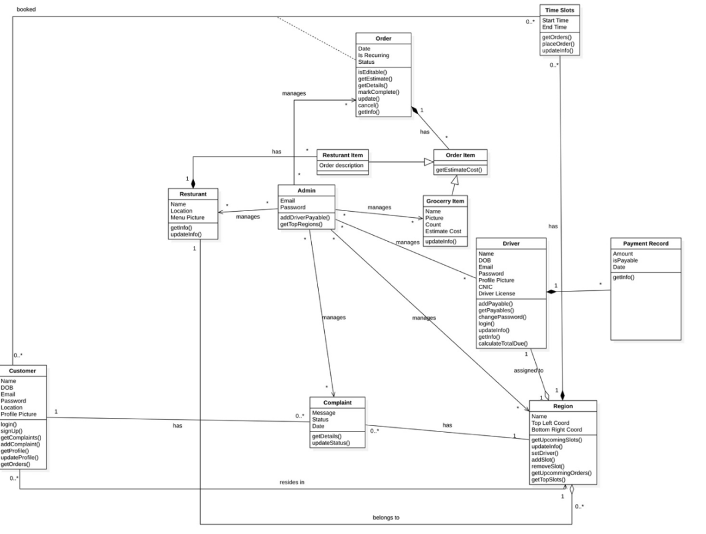
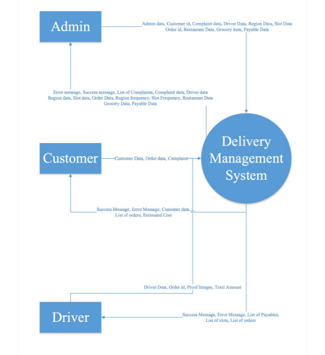
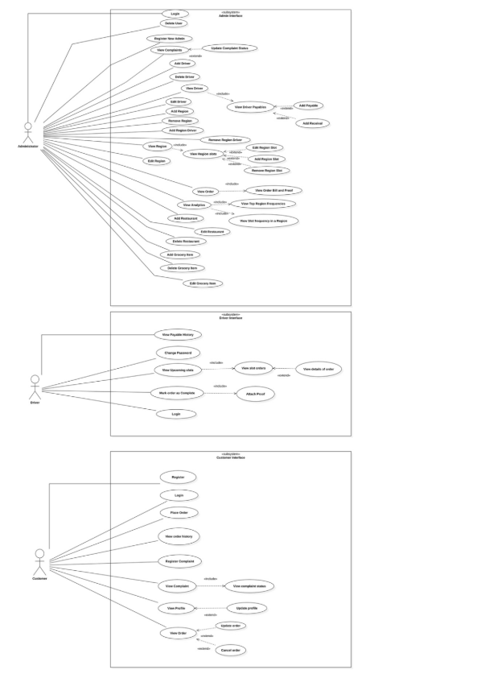

**Software Requirements**    
**Specification**

**DeliverU**

**1\. Introduction**

**1.1 Product**

In today's fast paced and hectic lifestyle people find themselves overworked and overburdened. Time  has become one the most prized luxuries of life. In such conditions people find it very difficult to complete their daily chores and a simple trip for grocery shopping becomes a burden.  People are in dire need of a service that allows them to fulfill their grocery requirements from the  comfort of their homes. Unfortunately, all the existing delivery services tend to be overpriced,  unviable for small quantities of orders and require continuous input for recurring order needs.  “*DeliverU*” aims to solve all these issues and provide relief to such individuals.

Our product aims to lower the delivery charges by allocating specific slots for drivers to make rounds  of predefined regions. The time slots will be specifically planned according to peak demand hours.  This way multiple orders would be handled in a single round which would allow us to provide much  lower delivery costs as well as save time for the driver. Moreover, our product will provide users with  the facility to add recurring orders for a time slot which will be delivered to them on a daily basis  without having to place orders daily.

**1.2 Scope**

The product has been designed and implemented such that it can scale up to provide a nation-wide  cheap and convenient delivery service. The product will scale with time, but it will accomplish the  following tasks at all stages:

• Allow the customers to make orders in predefined slots within their region. • Allow the customer to make recurring orders which would be delivered daily without  requiring continuous inputs daily.

• Allow the customers to choose from a variety of grocery items of daily use and place an order  from a wide variety of local popular restaurants.

• Allow the admins to manage the system components like regions, time slots and order items. • Allow admins to view system analytics to make business decisions.

**1.3 Business Goals**

The end goal of the product is to create the opportunity for a profitable and scalable business while  facilitating busy individuals to fulfill their daily grocery requirements. The product aims to achieve  the following.

• To create a cost effective and efficient delivery network to fulfill the needs of the customers. • To capture the majority market, share of the current delivery services by providing a cheaper  and easy to use alternative.

• To provide an accessible delivery solution to small businesses without an effective delivery  network which could help scale their businesses.

• To develop mutually beneficial relations with other businesses.

**1.4 Document Conventions**

The document uses the “Times New Roman” family. The top-level heading size is 18pt while the sub heading size is 14pt and the paragraph size is 12pt with a line spacing of 1.5. External Names are  quoted and italicized. The use of the word “Product”, “Application” and “System” refers to  “*DeliverU*”. The use of “Us”, “Our” or “We” refers to “Team 1”. The use of the term “*Organization”*  and *“Client”* refers to *“E”.*

**2\. Overall Description**

**2.1 Product Features**

*“DeliverU”* will be an order management system that shall allow “*Customers”* to order items i.e.  groceries and selected restaurants’ products which shall be delivered to their doorsteps.

*“DeliverU”* shall be used by three types of users i.e.:

• Admins

• Customers

• Drivers

Each type of user shall have a separate interface to interact with the system according to their roles  which are identified below.

**2.1.1 Admin Interface**

• Admin shall register new admins.

• Admin shall manage Drivers and their Regions.

• Admin shall add and remove Region Time Slots.

• Admin shall delete Customers.

• Admin shall manage groceries.

• Admin shall manage restaurants information including their name and locations. • Admin shall view the detail of individual orders.

• Admin shall review complaints made by Customers and update status of the complaint. • Admin shall view system analytics.

• Admin shall maintain driver payables.

**2.1.2 Driver Interface**

• Driver shall login into the application.

• Driver shall view orders placed in upcoming slots in their region.

• Driver shall view individual order details.

• Driver shall view payable history.

• Driver shall update order status.

**2.1.3 Customer Interface**

• Customer shall register and login into the application.

• Customer shall browse available order items and upcoming time slots.

• Customer shall manage order in upcoming available (availability based on time left and total  orders) time slots.

• Customer shall view their order history.

• Customer shall register and view their complaints.

• Customer shall view their region’s drivers.

• Customer shall manage their profile.

**2.2 User Classes and Characteristics**

The user classes who would be interacting with our system can be broadly classified into three distinct  categories.

**2.2.1 Customers**

The customer will be the end user of our product. A customer will generally be from all age groups.  The target audience for this category would be students, especially those living away from home,  Moreover the target audience would also include members from the working class who need cheap  delivery services on a daily basis both for their home needs and their office needs. Most of these  people shall be short on time and shall require assistance in their grocery shopping. Users of this  category will be fairly experienced in using smartphones.

**2.2.2 Drivers**

The majority of the people belonging to this category shall range from 18 to 30\. All of them would have  a valid bike driving license and a working bike. Most of these people would originally be unemployed  and looking for a viable source of income. An average driver would have the technical know-how to  use a mobile application, understand routes of the region they are assigned and have appropriate  shopping skills.

**2.2.3 Admin**

The admin would be at the core of the administration and management of the application. The admin  would be a technically literate individual with deep understanding of the market and astute  management skills. The admin would be a highly trusted member of the team and will be in direct  contact with the business owner.

**2.3 Operating Environment**

“*DeliverU*” customer and driver interface will be accessible on any mobile device running “*Android  5.0+*”, having an active internet connection and having a location sensor. While the admin panel of  “*DeliverU*” shall be accessible on modern day browsers including “*Chrome*”, “*Firefox*”, “*Safari*” and  “*Opera*”.

**2.4 Design and Implementation Constraints**

One of the biggest constraints has been the selection of appropriate technology stack and design tools. After taking into consideration both the client’s requirements as well as the comfort level and  experience of the development team, following are the finalized tools and frameworks.

• FastAPI Backend - Async Python web framework  
• React Frontend - Vite-powered with React Router -> Should be mobile friendly  
• JWT Authentication - Access & refresh tokens  
• PostgreSQL - Primary database with SQLModel ORM  
• Redis - Caching and background job broker  
• MinIO - S3-compatible object storage  
• TaskIQ - Background job processing   
• Docker - Full containerization with compose  
• Alembic - Database migrations  
• GitHub   
• Amazon Web Services

**2.5 Assumptions and Dependencies**

The successful implementation and working of the product rely on the following assumptions.
 • The application complexity(front end) in terms of system resources utilization will never exceed the level  that would make it unscalable as a web app that we can not run on mobile

• The client will ensure that the budget allocation be proportionate to the initial server requirements and the budget will scale proportionately.

• The driver maintains utmost integrity and honesty in terms of responsibility and duties  assigned by the administrator to a slot order.

• The driver shall always have running amount of money available to

• A strict accountability and policing policy would be kept in effect by the administrator. All  complaints against the driver, especially those regarding dishonest behavior, would be dealt  very strictly by the admin.

• All grocery items added by the admin would be readily available in all regions at all slot times. Additionally, it is also vital that the technology stack used by the team remains available and feasible  throughout the project lifecycle.

**3\. Functional Requirements 3.1 Place  Order**

| Field | Description |
| --- | --- |
| **Identifier** | UC-1 |
| **Purpose** | To allow the customer to place an order |
| **Priority** | High |
| **Actors** | Customer |
| **Pre-conditions** | The customer is logged in and is currently is on his home page |
| **Post-conditions** | The order has been placed. |

---

### Typical Course of Action

| S# | Actor Action | System Response |
| --- | --- | --- |
| 1 | User clicks on the place order button. | User location is verified (accurate,  nearby a serviceable region), and user  taken to the order placing page and  shown available time slots for the next  24 hours |
| 2 | User selects a time slot | List of available grocery items, price  range and nearby open restaurant are  shown |
| 3 | User add grocery items and quantity | User current order is updated |
| 4 | User selects a restaurant, views menu  and types the order (Optional) | User current order is updated |
| 5 | User adds additional notes about order  (Optional) | User current order is updated |
| 6 | User marks the order as recurring  (Optional) | User current order is updated |
| 7 | User places order | User current order is saved, order is  placed for the driver to be seen and user  taken to home page |

---

### Alternate Course of Action (1b)

| S# | Actor Action | System Response |
| --- | --- | --- |
| 1b | User clicks on the place order button | User location is not accessible. User is  notified and taken to his profile to update the location and/or check his device location permissions |

---

### Alternate Course of Action (1c)

| S# | Actor Action | System Response |
| --- | --- | --- |
| 1c | User does not select any grocery item | User order is not placed and prompted  to enter at least one item |

**Table 1: UC-1**

**3.2 Update order**

| Field | Description |
| --- | --- |
| **Identifier** | UC-2 |
| **Purpose** | To allow the customer to change the details and preference of the  order he/she has placed |
| **Priority** | High |
| **Actors** | Customer |
| **Pre-conditions** | The customer is logged in, on the home page and the customer has  a list of pending (unlocked) orders with their time slots for which  the driver has not started his/her delivery i.e. half hour before the  timeslot start time |
| **Post-conditions** | A pending order is updated |

---

### Typical Course of Action

| S# | Actor Action | System Response |
| --- | --- | --- |
| 1 | User selects an order | User is taken to the order detail page |
| 2 | User changes the type and quantity of  grocery items (Optional) | User current order is updated |
| 3 | User changes the details of the order  ordered from a restaurant (Optional) | User current order is updated |
| 4 | User changes the additional notes of the  order (Optional) | User current order is updated |
| 5 | User changes the recurrence property of  the order (Optional) | User current order is updated |
| 6 | User removes a grocery items (Optional) | User current order is updated |
| 7 | User removes a restaurant order | User current order is updated |
| 8 | User clicks on add order item button  (Optional) | List of available grocery items, price  range and nearby open restaurant are  shown |
| 9 | User add grocery items and quantity  (Optional) | User current order is placed |
| 10 | User selects a restaurant, views menu  and types the order (Optional) | User current order is placed |
| 11 | User clicks the update button | User current order is updated. If all  order items are removed the order is  removed and user notified and taken to  the home page |

**Table 2: UC-2**

**3.3 Cancel order**

| Field | Description |
| --- | --- |
| **Identifier** | UC-3 |
| **Purpose** | To allow the customer to delete an order |
| **Priority** | High |
| **Actors** | Customer |
| **Pre-conditions** | The customer is logged in, on the home page and the customer has  a list pending (unlocked) orders with their time slots for which the  driver has not started his/her delivery i.e. half hour before the time  slot start time |
| **Post-conditions** | A pending order is updated |

---

### Typical Course of Action

| S# | Actor Action | System Response |
| --- | --- | --- |
| 1 | User selects an order | User is taken to the order detail page |
| 2 | User clicks the cancel button | User is prompted to confirm. The order  is cancelled |

---

### Alternate Course of Action (1b)

| S# | Actor Action | System Response |
| --- | --- | --- |
| 1b | User does not confirm | User is taken back to the order detail  page |

**Table 3: UC-3**

**3.4 View complaint info**

| Field | Description |
| --- | --- |
| **Identifier** | UC-4 |
| **Purpose** | To allow the customer to view the complaints they have lodged  and their status |
| **Priority** | High |
| **Actors** | Customer |
| **Pre-conditions** | The user is logged in |
| **Post-conditions** | The user has viewed the status of all complaints they have filed |

---

### Typical Course of Action

| S# | Actor Action | System Response |
| --- | --- | --- |
| 1 | User clicks on the complaint button | User is taken to the complaint page and  the list of all complaint filed with their  status are shown |
| 2 | User click a complaint | User is shown the region and the region  of the specific complaint |

**Table 4: UC-4**

**3.5 Register complaint**

| Field | Description |
| --- | --- |
| **Identifier** | UC-5 |
| **Purpose** | To allow the customer to register complaints and any discrepancy  against their driver |
| **Priority** | High |
| **Actors** | Customer |
| **Pre-conditions** | The user is logged in and has placed and received at least one  delivery |
| **Post-conditions** | A complaint has been lodged |

---

### Typical Course of Action

| S# | Actor Action | System Response |
| --- | --- | --- |
| 1 | User clicks on the complaint button | User is taken to the complaint page. All previous complaints with their  current status are shown |
| 2 | The user type in the complaint including  their order number, driver name, delivery  date | User complaint is filed. User is notified  and taken to the home page |

---

### Alternate Course of Action (1b)

| S# | Actor Action | System Response |
| --- | --- | --- |
| 1b | User does not include the order number,  driver name and /or delivery date. | The complaint is not filed, and the user  is notified |

**Table 5: UC-5**

**3.6 View and Update Profile**

| Field | Description |
| --- | --- |
| **Identifier** | UC-6 |
| **Purpose** | To allow the customer to view and update their profile |
| **Priority** | Medium |
| **Actors** | Customer |
| **Pre-conditions** | The user is logged in |
| **Post-conditions** | The user profile is updated |

---

### Typical Course of Action

| S# | Actor Action | System Response |
| --- | --- | --- |
| 1 | User clicks on the profile button | User is taken to his/her profile where all  his/her information (name, phone  number, picture,) is visible as editable  fields.  Separate fields for the current password  and new password are shown.  While his/her email is visible as locked. |
| 2 | User updates the required information by  editing the relevant field (Optional) | - |
| 3 | User clicks the update location button  (Optional) | User location is updated and the closest  region to the user is assigned |
| 4 | User clicks the update button | User profile is updated |

---

### Alternate Course of Action (1a)

| S# | Actor Action | System Response |
| --- | --- | --- |
| 1a | User location is inaccessible or outside a  serviceable region | User is notified about the location  update failure and asked to update again  after ensuring location accessibility |

**Table 6: UC-6**

**3.7 View order history**

| Field | Description |
| --- | --- |
| **Identifier** | UC-7 |
| **Purpose** | To allow the customer to view the orders he has placed |
| **Priority** | High |
| **Actors** | Customer |
| **Pre-conditions** | The user is logged in |
| **Post-conditions** | The user has viewed the status of all complaints they have filed |

---

### Typical Course of Action

| S# | Actor Action | System Response |
| --- | --- | --- |
| 1 | User clicks on the Order button | User is taken to the Orders page and the  list of all orders is shown |

**Table 7: UC-7**

**3.8 View complaints**

| Field | Description |
| --- | --- |
| **Identifier** | UC-8 |
| **Purpose** | To allow the customer to view the complaints they have lodged  and their status |
| **Priority** | Medium |
| **Actors** | Customer |
| **Pre-conditions** | The user is logged in |
| **Post-conditions** | The user has viewed the status of all complaints they have filed |

---

### Typical Course of Action

| S# | Actor Action | System Response |
| --- | --- | --- |
| 1 | User clicks on the complaint button | User is taken to the complaint page and  the list of all complaint filed with their  status are shown |

**Table 8: UC-8**

**3.9 Login**

| Field | Description |
| --- | --- |
| **Identifier** | UC-9 |
| **Purpose** | To Log in to the *“DelieverU”* System |
| **Priority** | High |
| **Actors** | Customer |
| **Pre-conditions** | Login page is displayed |
| **Post-conditions** | User logged in |

---

### Typical Course of Action

| S# | Actor Action | System Response |
| --- | --- | --- |
| 1 | Enter username, password and tap Login  Button | Verify User Account and Log in the  user, redirect to homepage |

---

### Alternate Course of Action (1b)

| S# | Actor Action | System Response |
| --- | --- | --- |
| 1b | Invalid input or wrong combination | System shows the appropriate error |

**Table 9: UC-9**

**3.10 Sign Up**

| Field | Description |
| --- | --- |
| **Identifier** | UC-10 |
| **Purpose** | To create new account for a customer |
| **Priority** | High |
| **Actors** | Customer |
| **Pre-conditions** | Sign up page is displayed |
| **Post-conditions** | Registered and logged in |

---

### Typical Course of Action

| S# | Actor Action | System Response |
| --- | --- | --- |
| 1 | Enter Name, password, email, phone  number, location and tap the sign up button | Verify account does not exist, register the  customer and display homepage |

---

### Alternate Course of Action (1b)

| S# | Actor Action | System Response |
| --- | --- | --- |
| 1b | Input existing username, email, phone  number | System display message   username/email/number already registered |

---

### Alternate Course of Action (2b)

| S# | Actor Action | System Response |
| --- | --- | --- |
| 2b | Empty Field(s) | Prompt for missing fields |

**Table 10: UC-10**

**3.11 Delete Customer**

| Field | Description |
| --- | --- |
| **Identifier** | UC-11 |
| **Purpose** | To remove any user account |
| **Priority** | Low |
| **Actors** | Admin |
| **Pre-conditions** | Admin is logged in with the settings page displayed |
| **Post-conditions** | User data is removed, and directed back to settings page |

---

### Typical Course of Action

| S# | Actor Action | System Response |
| --- | --- | --- |
| 1 | Admin clicks customers option | Customer page is displayed |
| 2 | Admin filters out user by username | Filtered list appears |
| 3 | Admin clicks delete button in front of the  required user | System prompts for confirmation to  remove the user |
| 4 | Admin clicks yes | User is removed from the database |

---

### Alternate Course of Action (2b)

| S# | Actor Action | System Response |
| --- | --- | --- |
| 2b | Admin enters username of non-existing  user | Empty list appears |

---

### Alternate Course of Action (4b)

| S# | Actor Action | System Response |
| --- | --- | --- |
| 4b | Admin clicks no on confirmation prompt | User information is not removed from the  system |

**Table 11: UC-11**

**3.12 Register New Admin**

| Field | Description |
| --- | --- |
| **Identifier** | UC-12 |
| **Purpose** | To register a new admin |
| **Priority** | High |
| **Actors** | Admin |
| **Pre-conditions** | Admin page is logged in with settings page displayed |
| **Post-conditions** | A new admin is registered in the database, back to settings page |

---

### Typical Course of Action

| S# | Actor Action | System Response |
| --- | --- | --- |
| 1 | Admin clicks admin option | Admin page is displayed |
| 2 | Admin clicks new admin option | New Admin registration page is  displayed |
| 3 | Admin inputs name, username, email,  phone number, password, retype  password, date of birth in the fields and  presses save button | System verifies email in case it is  already present, registers new admin  into the database |

---

### Alternate Course of Action (3b)

| S# | Actor Action | System Response |
| --- | --- | --- |
| 3b | Admin enters already existing email | System prompt shown that email is  already existing. Stays on same page. |

---

### Alternate Course of Action (3c)

| S# | Actor Action | System Response |
| --- | --- | --- |
| 3c | Admin misses some required fields | System prompt shown that some  required field are missing. Stays on  same page. |

**Table 12: UC-12**

**3.13 Update Complaint Status**

| Field | Description |
| --- | --- |
| **Identifier** | UC-13 |
| **Purpose** | To update complaint status after a complaint has been resolved |
| **Priority** | Medium |
| **Actors** | Admin |
| **Pre-conditions** | Admin page is logged in with settings page displayed |
| **Post-conditions** | Complaint status is updated, and new status can be seen by the  user |

---

### Typical Course of Action

| S# | Actor Action | System Response |
| --- | --- | --- |
| 1 | Admin clicks settings page | Settings page is displayed |
| 2 | Admin clicks the complaints option | Complaints page is displayed where all  the complaints are displayed |
| 3 | Admin clicks the concerned complaint | Respected complaint is displayed |
| 4 | Admin clicks the status drop down and  selects the updated status from drop  down menu list and clicks save button | Complaint status is updated |

---

### Alternate Course of Action (4b)

| S# | Actor Action | System Response |
| --- | --- | --- |
| 4b | Admin clicks the status drop down,  selects the new status but does not click  save button and clicks some other page | Complaint status is not updated. Status  remains unchanged. Admin directed to  clicked page |

**Table 13: UC-13**

**3.14 View Pending Complaint**

| Field | Description |
| --- | --- |
| **Identifier** | UC-14 |
| **Purpose** | To view any pending complaints |
| **Priority** | Low |
| **Actors** | Admin |
| **Pre-conditions** | Admin page is logged in with settings page displayed |
| **Post-conditions** | Desired Pending Complaint is displayed |

---

### Typical Course of Action

| S# | Actor Action | System Response |
| --- | --- | --- |
| 1 | Admin clicks settings page | Settings page is displayed |
| 2 | Admin clicks the complaints option | Complaints page is displayed where all  the complaints are displayed |
| 3 | Admin clicks the complaint he/she wants  to see | Desired complaint is now displayed in  separate page |

**Table 14: UC-14**

**3.15 Add Driver**

| Field | Description |
| --- | --- |
| **Identifier** | UC-15 |
| **Purpose** | To register a new driver |
| **Priority** | High |
| **Actors** | Admin |
| **Pre-conditions** | Admin page is logged in with settings page displayed |
| **Post-conditions** | A new driver is added in the database, back to settings page |

---

### Typical Course of Action

| S# | Actor Action | System Response |
| --- | --- | --- |
| 1 | Admin clicks settings page | Settings page is displayed |
| 2 | Admin clicks the drivers' options | Drivers page is displayed |
| 3 | Admin clicks add new driver option | Add Driver page is displayed |
| 4 | Admin enters driver details (name,  username, password, email, phone  number, date of birth, license number,  CNIC) | - |
| 5 | Admin attaches driver image | - |
| 6 | Admin clicks save button | New driver is registered and redirected  to the homepage |

---

### Alternate Course of Action (6b)

| S# | Actor Action | System Response |
| --- | --- | --- |
| 6b | Admin enters already existing email | System prompt shown that email is  already existing. Stays on same page. |

---

### Alternate Course of Action (6c)

| S# | Actor Action | System Response |
| --- | --- | --- |
| 6c | Admin misses some required fields | System prompt shown that some  required field are missing. Stays on  same page. |

**Table 15: UC-15**

**3.16 Edit Driver**

| Field | Description |
| --- | --- |
| **Identifier** | UC-16 |
| **Purpose** | To edit the driver related information |
| **Priority** | Medium |
| **Actors** | Admin |
| **Pre-conditions** | Admin page is logged in with settings page displayed |
| **Post-conditions** | Driver information is updated in the database, back to settings  page |

---

### Typical Course of Action

| S# | Actor Action | System Response |
| --- | --- | --- |
| 1 | Admin clicks settings page | Settings page is displayed |
| 2 | Admin clicks the driver's option | Drivers page is displayed. All drivers  are listed. |
| 3 | Admin searches the driver | Driver is filtered |
| 4 | Admin clicks edit option in front of the  concerned driver | Driver information is displayed and is  editable now |
| 5 | Admin edits the information and clicks  save | Information is updated |

---

### Alternate Course of Action (3b)

| S# | Actor Action | System Response |
| --- | --- | --- |
| 3b | Admin enters a non-existing email | System prompts that email is not found |

---

### Alternate Course of Action (5b)

| S# | Actor Action | System Response |
| --- | --- | --- |
| 5b | Admin edits information but does not  click save and clicks some other page | Information is not updated. Admin  directed to clicked page |

**Table 16: UC-16**

**3.17 Delete Driver**

| Field | Description |
| --- | --- |
| **Identifier** | UC-17 |
| **Purpose** | To remove a driver |
| **Priority** | Medium |
| **Actors** | Admin |
| **Pre-conditions** | Admin page is logged in with settings page displayed |
| **Post-conditions** | Driver information is removed from the database, back to settings  page |

---

### Typical Course of Action

| S# | Actor Action | System Response |
| --- | --- | --- |
| 1 | Admin clicks settings page | Settings page is displayed |
| 2 | Admin clicks the driver's option | Drivers page is displayed |
| 3 | Admin searches the driver | Driver is filtered out and displayed |
| 4 | Admin clicks delete button in fron of the  driver | Driver information is displayed and  system prompt to confirm delete |
| 5 | Admin clicks confirm button | Driver information is removed from the  database |

---

### Alternate Course of Action (3b)

| S# | Actor Action | System Response |
| --- | --- | --- |
| 3b | Admin enters a non-existing email | System prompts that email not found |

---

### Alternate Course of Action (5b)

| S# | Actor Action | System Response |
| --- | --- | --- |
| 5b | Admin clicks cancel the button instead  of confirming | Driver information is not removed from  the database |

**Table 17: UC-17**

**3.18 View Driver**

| Field | Description |
| --- | --- |
| **Identifier** | UC-18 |
| **Purpose** | To view a driver |
| **Priority** | Medium |
| **Actors** | Admin |
| **Pre-conditions** | Admin page is logged in with settings page displayed |
| **Post-conditions** | Driver information is displayed |

---

### Typical Course of Action

| S# | Actor Action | System Response |
| --- | --- | --- |
| 1 | Admin clicks settings page | Settings page is displayed |
| 2 | Admin clicks the driver's option | Drivers page is displayed |
| 3 | Admin searches the driver | Driver is displayed |
| 4 | Admin clicks view option | Driver information is displayed |

---

### Alternate Course of Action (3b)

| S# | Actor Action | System Response |
| --- | --- | --- |
| 3b | Admin enters a non-existing email | System prompts that email not found |

**Table 18: UC-18**

**3.19 Add Region**

| Field | Description |
| --- | --- |
| **Identifier** | UC-19 |
| **Purpose** | To add a new region where our delivery service would be  available |
| **Priority** | High |
| **Actors** | Admin |
| **Pre-conditions** | Admin page is logged in with settings page displayed |
| **Post-conditions** | A new region is added successfully, region page is displayed |

---

### Typical Course of Action

| S# | Actor Action | System Response |
| --- | --- | --- |
| 1 | Admin clicks settings page | Settings page is displayed |
| 2 | Admin clicks regions option | Regions page is displayed |
| 3 | Admin clicks add new region option | Add region page is displayed |
| 4 | Admin selects endpoints on the map and  enters name | Region is highlighted on the map |
| 5 | Admin clicks save | Co-ordinates are saved as a new region  in the database |

---

### Alternate Course of Action (5b)

| S# | Actor Action | System Response |
| --- | --- | --- |
| 5b | Admin cancels after selecting the  endpoints on the map | Co-ordinates are not saved, stays on  same page |

---

### Alternate Course of Action (5c)

| S# | Actor Action | System Response |
| --- | --- | --- |
| 5c | Admin missed some field | System prompt to fill all fields |

**Table 19: UC-19**

**3.20 Edit Region**

| Field | Description |
| --- | --- |
| **Identifier** | UC-20 |
| **Purpose** | To edit an already present region area in the database |
| **Priority** | High |
| **Actors** | Admin |
| **Pre-conditions** | Admin page is logged in with settings page displayed |
| **Post-conditions** | Region area is updated, region page is displayed |

---

### Typical Course of Action

| S# | Actor Action | System Response |
| --- | --- | --- |
| 1 | Admin clicks settings page | Settings page is displayed |
| 2 | Admin clicks regions option | Regions page is displayed |
| 3 | Admin clicks edit option | Edit page is displayed |
| 4 | Admin selects a point and update its co ordinates and clicks update | Co-ordinates are updated in the   database |

---

### Alternate Course of Action (4b)

| S# | Actor Action | System Response |
| --- | --- | --- |
| 4b | Admin cancels after selecting the end points on the map | Co-ordinates remain unchanged, stays  on same page |

---

### Alternate Course of Action (4c)

| S# | Actor Action | System Response |
| --- | --- | --- |
| 4c | Admin misses some field | System prompts to ask admin to fill all  fields |

**Table 20: UC-20**

**3.21 Add Region Driver**

| Field | Description |
| --- | --- |
| **Identifier** | UC-21 |
| **Purpose** | To assign a driver to the region that is already present |
| **Priority** | High |
| **Actors** | Admin |
| **Pre-conditions** | Admin page is logged in with settings page displayed |
| **Post-conditions** | A new driver is added in the list of respected region drivers,  region page is displayed |

---

### Typical Course of Action

| S# | Actor Action | System Response |
| --- | --- | --- |
| 1 | Admin clicks settings page | Settings page is displayed |
| 2 | Admin clicks regions option | Regions page is displayed |
| 3 | Admin clicks the region for which driver  is to be added | Region details are displayed |
| 4 | Admin clicks add region driver | Drivers list is displayed |
| 5 | Admin selects a driver | System prompt containing name of  driver for confirmation of assignment |
| 6 | Admin clicks batch actions and save | A new driver is assigned for the region |

---

### Alternate Course of Action (5b)

| S# | Actor Action | System Response |
| --- | --- | --- |
| 5b | Admin selects multiple drivers at a time | All the selected drivers are assigned to  the region, entered in the list of   respected region drivers |

---

### Alternate Course of Action (6b)

| S# | Actor Action | System Response |
| --- | --- | --- |
| 6b | Admin selects the driver/s but then  cancels | No new driver is assigned to the region |

**Table 21: UC-21**

**3.22 Remove Region Driver**

| Field | Description |
| --- | --- |
| **Identifier** | UC-22 |
| **Purpose** | To remove a driver from a region’s list of drivers |
| **Priority** | High |
| **Actors** | Admin |
| **Pre-conditions** | Admin page is logged in with settings page displayed |
| **Post-conditions** | Selected driver is removed from the list of drivers of that region,  region page is displayed |

---

### Typical Course of Action

| S# | Actor Action | System Response |
| --- | --- | --- |
| 1 | Admin clicks settings page | Settings page is displayed |
| 2 | Admin clicks regions option | Regions page is displayed |
| 3 | Admin selects the region | Region information is displayed |
| 4 | Admin clicks delete option in front of the  driver needed to be removed | System prompt containing name of  driver for confirmation of removal |
| 5 | Admin confirms | Selected driver is removed from the  region |

---

### Alternate Course of Action (4b)

| S# | Actor Action | System Response |
| --- | --- | --- |
| 4b | Admin selects multiple drivers at a time | All the selected drivers are removed  from the region |

---

### Alternate Course of Action (5b)

| S# | Actor Action | System Response |
| --- | --- | --- |
| 5b | Admin selects the driver/s but then  cancels | Region drivers list remains unchanged |

**Table 22: UC-22**

**3.23 Add Region Slot**

| Field | Description |
| --- | --- |
| **Identifier** | UC-23 |
| **Purpose** | To add a slot of delivery in a region |
| **Priority** | High |
| **Actors** | Admin |
| **Pre-conditions** | Admin page is logged in with settings page displayed |
| **Post-conditions** | A new slot is added in the lists of slots of the region |

---

### Typical Course of Action

| S# | Actor Action | System Response |
| --- | --- | --- |
| 1 | Admin clicks settings page | Settings page is displayed |
| 2 | Admin clicks regions option | Regions page is displayed |
| 3 | Adim clicks the region | Region information is displayed |
| 4 | Admin clicks add new slot | A new page is displayed having field of  start and end time of the slot |
| 5 | Admin selects time for start and end  times and clicks the save button | A new slot is added to the list, region  page with updated list of slots is  displayed |

---

### Alternate Course of Action (5b)

| S# | Actor Action | System Response |
| --- | --- | --- |
| 5b | Start time is selected greater than end  time | System prompt for invalid time   selection |

---

### Alternate Course of Action (5c)

| S# | Actor Action | System Response |
| --- | --- | --- |
| 5c | Admin selects the both times but then  cancels | Region page is displayed with   unchanged time slots |

**Table 23: UC-23**

**3.24 Remove Region**

| Field | Description |
| --- | --- |
| **Identifier** | UC-24 |
| **Purpose** | To remove the region where our service is now terminated |
| **Priority** | High |
| **Actors** | Admin |
| **Pre-conditions** | Admin page is logged in with settings page displayed |
| **Post-conditions** | Region is removed from the list of regions, updated list of regions  is displayed |

---

### Typical Course of Action

| S# | Actor Action | System Response |
| --- | --- | --- |
| 1 | Admin clicks settings page | Settings page is displayed |
| 2 | Admin clicks regions option | Regions page is displayed |
| 3 | Admin clicks delete option in front of the  required region | System prompt for confirmation |
| 4 | Admin clicks yes | Region is removed from the database  and list of updated regions is displayed |

---

### Alternate Course of Action (4b)

| S# | Actor Action | System Response |
| --- | --- | --- |
| 4b | Admin selects multiple regions and  presses delete and confirms yes | All the selected regions are removed  from the list and list of updated regions  is displayed |

**Table 24: UC-24**

**3.25 Edit Region Slot**

| Field | Description |
| --- | --- |
| **Identifier** | UC-25 |
| **Purpose** | To edit slot time of a slot in a region |
| **Priority** | High |
| **Actors** | Admin |
| **Pre-conditions** | Admin page is logged in with settings page displayed |
| **Post-conditions** | Slot time of the selected slot is updated, page displaying the  region and its slots is displayed |

---

### Typical Course of Action

| S# | Actor Action | System Response |
| --- | --- | --- |
| 1 | Admin clicks settings page | Settings page is displayed |
| 2 | Admin clicks regions option | Regions page is displayed |
| 3 | Admin clicks the required region | Region information is displayed |
| 4 | Admin clicks the edit option in front of  the required slot | A new page is displayed having field of  start and end time of the slot |
| 5 | Admin selects a new time for both, and  clicks the save button | Slot start and end time is updated and  page with the region and its slots is  displayed |

---

### Alternate Course of Action (5b)

| S# | Actor Action | System Response |
| --- | --- | --- |
| 5b | Start time is selected greater than end  time | System prompt for invalid time   selection |

---

### Alternate Course of Action (5c)

| S# | Actor Action | System Response |
| --- | --- | --- |
| 5c | Admin selects the both times but then  cancels | Region page is displayed with   unchanged time slots |

**Table 25: UC-25**

**3.26 Remove Region Slot**

| Field | Description |
| --- | --- |
| **Identifier** | UC-26 |
| **Purpose** | To remove a slot from a region |
| **Priority** | High |
| **Actors** | Admin |
| **Pre-conditions** | Admin page is logged in with settings page displayed |
| **Post-conditions** | Selected slot is removed from the list of slots of the region and  updated list of slots is displayed |

---

### Typical Course of Action

| S# | Actor Action | System Response |
| --- | --- | --- |
| 1 | Admin clicks settings page | Settings page is displayed |
| 2 | Admin clicks regions option | Regions page is displayed |
| 3 | Admin clicks the concerned region | Region information is displayed |
| 4 | Admin clicks the delete button in front of  the required slot | confirmation to delete |
| 5 | Admin selects yes | Slot is removed from the list of slots  and updated list of slots is displayed |

---

### Alternate Course of Action (5b)

| S# | Actor Action | System Response |
| --- | --- | --- |
| 5b | Admin selects cancel | List of slots remains unchanged and list  is displayed |

**Table 26: UC-26**

**3.27 View Order**

| Field | Description |
| --- | --- |
| **Identifier** | UC-27 |
| **Purpose** | To view the order status and receipt |
| **Priority** | Medium |
| **Actors** | Admin |
| **Pre-conditions** | Admin page is logged in with settings page displayed |
| **Post-conditions** | Order status and details along with receipt are displayed |

---

### Typical Course of Action

| S# | Actor Action | System Response |
| --- | --- | --- |
| 1 | Admin clicks settings page | Settings page is displayed |
| 2 | Admin clicks orders option | Page containing the list of orders is  displayed |
| 3 | Admin clicks the desired order | Order details are displayed on separate  page, receipt would be displayed at the  bottom if order is completed |

**Table 27: UC-27**

**3.28 View Analytics**

| Field | Description |
| --- | --- |
| **Identifier** | UC-28 |
| **Purpose** | To view the analysis of frequent slots and regions |
| **Priority** | Medium |
| **Actors** | Admin |
| **Pre-conditions** | Admin page is logged in with settings page displayed |
| **Post-conditions** | Analysis graph is displayed showing the busiest slots/regions |

---

### Typical Course of Action

| S# | Actor Action | System Response |
| --- | --- | --- |
| 1 | Admin clicks settings page | Settings page is displayed |
| 2 | Admin clicks the analytics option | Analysis page is displayed with options  Region and Slot |
| 3 | Admin clicks week | Graph of an analysis of regions is  displayed based on orders in the region in a week |

---

### Alternate Course of Action (3b)

| S# | Actor Action | System Response |
| --- | --- | --- |
| 3b | Admin clicks month | Graph of an analysis of regions is  displayed based on orders in the region  in a month |

**Table 28: UC-28**

**3.29 Add Restaurant**

| Field | Description |
| --- | --- |
| **Identifier** | UC-29 |
| **Purpose** | To add a new restaurant for delivery |
| **Priority** | High |
| **Actors** | Admin |
| **Pre-conditions** | Admin page is logged in with settings page displayed |
| **Post-conditions** | New restaurant is added to the list of restaurants |

---

### Typical Course of Action

| S# | Actor Action | System Response |
| --- | --- | --- |
| 1 | Admin clicks settings page | Settings page is displayed |
| 2 | Admin clicks restaurants option | Restaurants page is displayed   containing the list of all the restaurants  from where delivery is done |
| 3 | Admin clicks the add new restaurant | Separate page is displayed having  relevant fields (name, phone number,  location, region, timings and attachment  options) |
| 4 | Admin enters relevant details, selects a  region from drop down, attaches menu  image and clicks save | System prompt confirmation to add the  restaurant |
| 5 | Admin clicks yes | Restaurant is added to the list of  restaurants, list of all restaurants is  displayed |

---

### Alternate Course of Action (4b)

| S# | Actor Action | System Response |
| --- | --- | --- |
| 4b | Admin misses any of the required  information fields and clicks yes | System prompt to ask for all the  information |

---

### Alternate Course of Action (5b)

| S# | Actor Action | System Response |
| --- | --- | --- |
| 5b | Admin clicks cancel | Information entered by admin is  displayed and the restaurant is not  added |

**Table 29: UC-29**

**3.30 Edit Restaurant**

| Field | Description |
| --- | --- |
| **Identifier** | UC-30 |
| **Purpose** | To update information of a currently present restaurant |
| **Priority** | Medium |
| **Actors** | Admin |
| **Pre-conditions** | Admin page is logged in with settings page displayed |
| **Post-conditions** | Information is updated and the list of restaurants is displayed |

---

### Typical Course of Action

| S# | Actor Action | System Response |
| --- | --- | --- |
| 1 | Admin clicks settings page | Settings page is displayed |
| 2 | Admin clicks restaurants option | Restaurants page is displayed   containing the list of all the restaurants  from where delivery is done |
| 3 | Admin click the edit in front of the  restaurant | Details of the restaurant is displayed on  separate page |
| 4 | Admin changes the name or phone  number of the restaurant and clicks save | System prompt to confirm the update |
| 5 | Admin clicks yes | Restaurant information is updated. List  of all the restaurants is displayed |

---

### Alternate Course of Action (4b)

| S# | Actor Action | System Response |
| --- | --- | --- |
| 4b | Admin misses any of the three required  information and clicks yes | System prompt to ask for all the  information |

---

### Alternate Course of Action (4c)

| S# | Actor Action | System Response |
| --- | --- | --- |
| 4c | Admin selects a different region | System prompt to confirm the update |
| 5 | Admin clicks yes | Restaurant information is updated. List  of all the restaurants is displayed |

---

### Alternate Course of Action (4d)

| S# | Actor Action | System Response |
| --- | --- | --- |
| 4d | Admin selects a different menu image | System prompt to confirm the update |
| 5 | Admin clicks yes | Restaurant information is updated. List  of all the restaurants is displayed |

**Table 30: UC-30**

**3.31 Delete Restaurant**

| Field | Description |
| --- | --- |
| **Identifier** | UC-31 |
| **Purpose** | To remove a restaurant for which delivery is no longer provided |
| **Priority** | Medium |
| **Actors** | Admin |
| **Pre-conditions** | Admin page is logged in with settings page displayed |
| **Post-conditions** | Restaurant is removed and the list of restaurants is displayed |

---

### Typical Course of Action

| S# | Actor Action | System Response |
| --- | --- | --- |
| 1 | Admin clicks settings page | Settings page is displayed |
| 2 | Admin clicks restaurants option | Restaurants page is displayed   containing the list of all the restaurants  from where delivery is done |
| 3 | Admin click the delete button in front of  the restaurant to be deleted | System prompt shows the name and  confirmation to deletion |
| 4 | Admin clicks yes | Restaurant is removed from the list and  updated list is displayed |

---

### Alternate Course of Action (3b)

| S# | Actor Action | System Response |
| --- | --- | --- |
| 3b | Admin selects multiple restaurants | System prompt shows names and  confirmation to deletion |
| 4 | Admin clicks no | List of restaurants remains unchanged |

**Table 31: UC-31**

**3.32 Add Grocery Item**

| Field | Description |
| --- | --- |
| **Identifier** | UC-32 |
| **Purpose** | To add a grocery item in the list of groceries |
| **Priority** | High |
| **Actors** | Admin |
| **Pre-conditions** | Admin page is logged in with settings page displayed |
| **Post-conditions** | A new grocery item is added in the list of groceries, updated list is  displayed |

---

### Typical Course of Action

| S# | Actor Action | System Response |
| --- | --- | --- |
| 1 | Admin clicks settings page | Settings page is displayed |
| 2 | Admin clicks groceries option | Groceries page is displayed showing the  list of all the groceries and estimated  prices |
| 3 | Admin clicks the add new grocery item | Page displayed with empty fields and  the system prompts to enter a name and  estimated price |
| 4 | Admin enters the name and estimated  price and clicks ok | System prompt to confirm the addition |
| 5 | Admin clicks yes | Grocery item is added in the list,  updated list is displayed |

---

### Alternate Course of Action (4b)

| S# | Actor Action | System Response |
| --- | --- | --- |
| 4b | Admin misses any of the two required  fields and clicks yes | System prompts to populate all fields |

**Table 32: UC-32**

**3.33 Edit Grocery Item**

| Field | Description |
| --- | --- |
| **Identifier** | UC-33 |
| **Purpose** | To edit an already existing grocery item |
| **Priority** | Medium |
| **Actors** | Admin |
| **Pre-conditions** | Admin page is logged in with settings page displayed |
| **Post-conditions** | Information of the grocery item is updated, list of groceries is  displayed |

---

### Typical Course of Action

| S# | Actor Action | System Response |
| --- | --- | --- |
| 1 | Admin clicks settings page | Settings page is displayed |
| 2 | Admin clicks groceries option | Groceries page is displayed showing the  list of all the groceries and estimated  prices |
| 3 | Admin clicks edit option in front of an  item | Grocery item is displayed in a separate  page with name and price field. Fields  are editable |
| 4 | Admin edits price and clicks the update  button | System prompt to confirm changes |
| 5 | Admin clicks yes | Grocery information is updated. The  List of groceries is displayed |

---

### Alternate Course of Action (4b)

| S# | Actor Action | System Response |
| --- | --- | --- |
| 4b | Admin misses any of the two required  fields and clicks yes | System prompts to populate all fields |

---

### Alternate Course of Action (4c)

| S# | Actor Action | System Response |
| --- | --- | --- |
| 4c | Admin edits only the name and clicks the  update button | System prompt to confirm changes |
| 5 | Admin clicks yes | Grocery information is updated. The list  of groceries is displayed |

**Table 33: UC-33**

**3.34 Delete Grocery Item**

| Field | Description |
| --- | --- |
| **Identifier** | UC-34 |
| **Purpose** | To remove a grocery item |
| **Priority** | Medium |
| **Actors** | Admin |
| **Pre-conditions** | Admin page is logged in with settings page displayed |
| **Post-conditions** | Grocery item is removed, and an updated items list is displayed |

---

### Typical Course of Action

| S# | Actor Action | System Response |
| --- | --- | --- |
| 1 | Admin clicks settings page | Settings page is displayed |
| 2 | Admin clicks groceries option | Groceries page is displayed, showing  the list of all the groceries and estimated  prices |
| 3 | Admin clicks on the delete button | Groceries can be selected now |
| 4 | Admin selects the grocery and presses  the delete button | System prompt showing the name of  grocery to confirm delete |
| 5 | Admin clicks yes | Grocery item is removed from the list of  items, updated list is displayed |

---

### Alternate Course of Action (4b)

| S# | Actor Action | System Response |
| --- | --- | --- |
| 4b | Admin selects multiple items and presses  the delete button | System prompt showing names of  groceries to confirm delete |
| 5 | Admin clicks yes | Selected item are removed from the list  of items, updated list is displayed |

---

### Alternate Course of Action (5b)

| S# | Actor Action | System Response |
| --- | --- | --- |
| 5b | Admin clicks cancel | Items remain selected but are not  deleted |

**Table 34: UC-34**

**3.35 Add Driver Payables**

| Field | Description |
| --- | --- |
| **Identifier** | UC-35 |
| **Purpose** | To add the payable of a driver |
| **Priority** | Medium |
| **Actors** | Admin |
| **Pre-conditions** | Admin page is logged in with settings page displayed |
| **Post-conditions** | Driver information is displayed with revised payables |

---

### Typical Course of Action

| S# | Actor Action | System Response |
| --- | --- | --- |
| 1 | Admin clicks settings page | Settings page is displayed |
| 2 | Admin clicks the driver's option | Drivers page is displayed |
| 3 | Admin selects a driver from list | Driver information is displayed |
| 4 | Admin clicks add new payable | Add payable page is displayed |
| 5 | Admin types order, type, amount and  date and presses save | Payable is added |

---

### Alternate Course of Action (3b)

| S# | Actor Action | System Response |
| --- | --- | --- |
| 3b | Admin enters a non-existing email while  searching | System prompts that email not found |

**Table 35: UC-35**

**3.36 Login**

| Field | Description |
| --- | --- |
| **Identifier** | UC-36 |
| **Purpose** | To Log in to the *“DelieverU”* System |
| **Priority** | High |
| **Actors** | Admin |
| **Pre-conditions** | Login page is displayed |
| **Post-conditions** | User logged in |

---

### Typical Course of Action

| S# | Actor Action | System Response |
| --- | --- | --- |
| 1 | Enter username, password and tap Login  Button | Verify User Account and Log in the  user, redirect to homepage |

---

### Alternate Course of Action (1b)

| S# | Actor Action | System Response |
| --- | --- | --- |
| 1b | Invalid input or wrong combination | System shows the appropriate error |

**Table 36: UC-36**

**3.37 Change Password**

| Field | Description |
| --- | --- |
| **Identifier** | UC-37 |
| **Purpose** | To change password |
| **Priority** | Medium |
| **Actors** | Admin |
| **Pre-conditions** | Admin page is logged in with settings page displayed |
| **Post-conditions** | Password change successfully |

---

### Typical Course of Action

| S# | Actor Action | System Response |
| --- | --- | --- |
| 1 | Admin clicks Change Password tab | Change Password page opens |
| 2 | Admin fills current password, new  password and retype new password  fields | - |
| 3 | Admin presses save | Password is updated |

---

### Alternate Course of Action (2b)

| S# | Actor Action | System Response |
| --- | --- | --- |
| 2b | New password and retype new password  fields not same | System shows the appropriate error |

**Table 37: UC-37**

**3.38 Add Driver Receival**

| Field | Description |
| --- | --- |
| **Identifier** | UC-38 |
| **Purpose** | To add the receival of a driver |
| **Priority** | Medium |
| **Actors** | Admin |
| **Pre-conditions** | Admin page is logged in with settings page displayed |
| **Post-conditions** | Driver information is displayed with revised receivals |

---

### Typical Course of Action

| S# | Actor Action | System Response |
| --- | --- | --- |
| 1 | Admin clicks settings page | Settings page is displayed |
| 2 | Admin clicks the driver's option | Drivers page is displayed |
| 3 | Admin selects a driver from list | Driver information is displayed |
| 4 | Admin clicks add new receival | Add receival page appears |
| 5 | Admin enters amount, type and date | - |
| 6 | Admin clicks save | New receival is added in the list |

---

### Alternate Course of Action (3b)

| S# | Actor Action | System Response |
| --- | --- | --- |
| 3b | Admin enters a non-existing email while  searching for driver | System prompts that email not found |

**Table 38: UC-38**

**3.39 Delete Driver Payable**

| Field | Description |
| --- | --- |
| **Identifier** | UC-39 |
| **Purpose** | To delete the payable of a driver |
| **Priority** | Medium |
| **Actors** | Admin |
| **Pre-conditions** | Admin page is logged in with settings page displayed |
| **Post-conditions** | Driver information is displayed with revised payables |

---

### Typical Course of Action

| S# | Actor Action | System Response |
| --- | --- | --- |
| 1 | Admin clicks settings page | Settings page is displayed |
| 2 | Admin clicks the driver's option | Drivers page is displayed |
| 3 | Admin selects a driver from list | Driver information is displayed |
| 4 | Admin clicks delete in front of the  required payable | Confirmation box appears |
| 5 | Admin clicks yes | Payable is removed from the list |

---

### Alternate Course of Action (3b)

| S# | Actor Action | System Response |
| --- | --- | --- |
| 3b | Admin enters a non-existing email | System prompts that email not found |

**Table 39: UC-39**

**3.40 Delete Driver Receival**

| Field | Description |
| --- | --- |
| **Identifier** | UC-40 |
| **Purpose** | To delete the receival of a driver |
| **Priority** | Medium |
| **Actors** | Admin |
| **Pre-conditions** | Admin page is logged in with settings page displayed |
| **Post-conditions** | Driver information is displayed with revised receivals |

---

### Typical Course of Action

| S# | Actor Action | System Response |
| --- | --- | --- |
| 1 | Admin clicks settings page | Settings page is displayed |
| 2 | Admin clicks the driver's option | Drivers page is displayed |
| 3 | Admin selects a driver from list | Driver information is displayed |
| 4 | Admin clicks the required receival | Confirmation box appears |
| 5 | Admin clicks yes | Receival is removed from the list |

---

### Alternate Course of Action (3b)

| S# | Actor Action | System Response |
| --- | --- | --- |
| 3b | Admin enters a non-existing email | System prompts that email not found |

**Table 40: UC-40**

**3.41 View Payable History**

| Field | Description |
| --- | --- |
| **Identifier** | UC-41 |
| **Purpose** | To view all the transactions, he/she has had with his/her  customers and the money he/she owes to the business |
| **Priority** | High |
| **Actors** | Driver |
| **Pre-conditions** | Driver is logged in and is on the homepage |
| **Post-conditions** | Driver gets a sum of all his expenses and earnings on the payable  history page |

---

### Typical Course of Action

| S# | Actor Action | System Response |
| --- | --- | --- |
| 1 | Driver taps settings page | Settings page is displayed |
| 2 | Driver taps Payable history | The payable history page is shown,  these are the amounts the driver owes to  the Admin against each delivery |

**Table 41: UC-41**

**3.42 Change Password**

| Field | Description |
| --- | --- |
| **Identifier** | UC-42 |
| **Purpose** | To change the password for his/her account |
| **Priority** | Low |
| **Actors** | Driver |
| **Pre-conditions** | Driver is logged in and is on the homepage |
| **Post-conditions** | Driver’s password is changed, and he can login using the new  password the next time he logs in |

---

### Typical Course of Action

| S# | Actor Action | System Response |
| --- | --- | --- |
| 1 | Driver taps settings page | Settings page is displayed |
| 2 | Driver taps change password button | Change Password page is opened |
| 3 | Driver types the old and new password  in the fields and taps ‘change password’ | System goes back to the settings page  and shows a toast if successful |

---

### Alternate Course of Action (1b)

| S# | Actor Action | System Response |
| --- | --- | --- |
| 1b | Driver inputs wrong old password on the  password change screen | Clears both the input boxes for new  input and shows an error toast |

**Table 42: UC-42**

**3.43 View Upcoming Slots**

| Field | Description |
| --- | --- |
| **Identifier** | UC-43 |
| **Purpose** | To view the orders in his upcoming slots |
| **Priority** | High |
| **Actors** | Driver |
| **Pre-conditions** | Driver is logged in and is on the homepage |
| **Post-conditions** | Driver is shown a list of his upcoming orders divided by their  time slots |

---

### Typical Course of Action

| S# | Actor Action | System Response |
| --- | --- | --- |
| 1 | Driver taps the upcoming orders tab | A list of orders is shown, divided  according to the time slots |

**Table 43: UC-43**

**3.44 View Order Details**

| Field | Description |
| --- | --- |
| **Identifier** | UC-44 |
| **Purpose** | To allow the driver to view the details and status of the order |
| **Priority** | Medium |
| **Actors** | Driver |
| **Pre-conditions** | Driver Profile is logged in with the orders page displayed,  displaying all upcoming live orders for the driver for time slots |
| **Post-conditions** | Shows the time of delivery, location, and item’s to be delivered in  that specific order, and a button to mark the delivery complete |

---

### Typical Course of Action

| S# | Actor Action | System Response |
| --- | --- | --- |
| 1 | Driver taps the ‘orders’ button | A list of orders is shown, divided  according to the time slots |
| 2 | Driver selects an order from the list | The order which was selected is  displayed with the delivery time, list of  items, and the location to where it needs  to be delivered, and a button to mark the  delivery complete |

**Table 44: UC-44**

**3.45 Attach Proof**

| Field | Description |
| --- | --- |
| **Identifier** | UC-45 |
| **Purpose** | To allow the driver to attach images with the order to show what  item he bought for what price |
| **Priority** | High |
| **Actors** | Driver |
| **Pre-conditions** | Driver is logged in and is on the homepage |
| **Post-conditions** | Driver’s uploaded images are added to the order, which can also  be seen by the Customer |

---

### Typical Course of Action

| S# | Actor Action | System Response |
| --- | --- | --- |
| 1 | Driver taps the orders tab | Orders page is displayed |
| 2 | Driver selects an order from the list | The order which was selected is  displayed with the Delivery time, list of  items, and the location to where it needs  to be delivered, and a button to mark the  delivery complete, or attach proof |
| 3 | Driver taps ‘Mark as completed’ button | Attach proof page is displayed |
| 3 | Driver taps attach proof | Opens gallery of the mobile device to  add images |
| 4 | Driver adds images and taps upload | Driver’s uploaded images are added to  the order, which can also be seen by the  Customer |

**Table 45: UC-45**

**3.46 Mark order as complete**

| Field | Description |
| --- | --- |
| **Identifier** | UC-46 |
| **Purpose** | To allow the driver to mark an order as complete after he has  delivered all the items to the customer and taken the cash from  him |
| **Priority** | High |
| **Actors** | Driver |
| **Pre-conditions** | Driver is logged in and is on the homepage |
| **Post-conditions** | Driver’s delivery is completed and counted at the database |

---

### Typical Course of Action

| S# | Actor Action | System Response |
| --- | --- | --- |
| 1 | Driver taps the orders tab | Orders page is displayed |
| 2 | Driver selects an order from the list | The order which was selected is  displayed with the Delivery time, list of  items, and the location to where it needs  to be delivered, and a button to mark the  delivery complete, or attach proof |
| 3 | Driver taps ‘Mark as complete’ | Driver’s delivery is completed and  counted at the database, the driver is  shown a toast with a success message  and the order is transferred to completed  orders by the driver |

**Table 46: UC-46**

**4\. Nonfunctional Requirements**

**4.1 Performance Requirements**

Initially the application shall meet the following performance benchmarks.

• A daily traffic of up to 1000 users should be able to use the application without performance  decline.

• Up to 100 users should be able to access the application simultaneously without performance  decline.

**4.2 Security Requirements**

Initially the application shall have the following security safeguards.

• HTTPS

• XSS safe development.

• Password irreversible hashing.

**4.3 Usability Requirements**

The system shall have the following UI/UX features.

• Intuitive and easy to use.

• No formal training required for the end user.

• User should not require more than 10 minutes to get familiar with the working of the  application.

• The design should follow a consistent theme.

• The user shall only need to navigate at most 4 screens from the homepage to place an order. **4.4 Extensibility Requirements**

The system shall be developed using a modular approach such that any addition and update in system  logic would not be a bottleneck.

**5\. Other Requirements**

The application shall intimate the user the following disclaimers before the user registers to use the  application.

• The application shall use the user location.

• The company shall not be legally liable for any damages or losses incurred by the user as a  result of using our system.

**6. Architecture Diagrams:**  
**5.1 Analysis Class Diagrams:**

**5.2 DFD Diagram**

**5.3  ER Diagram**

The legacy ER diagram image has been retired.

Use the maintained implementation ER reference in `docs/er-model.md`.

**5.4 Use Case Diagram**

**7. Screenshots:**

**Appendix A: Glossary**

| Time Slots  | Times allocated to regions in which the driver will make deliveries.  Defined by Admin. |
| :---- | :---- |
| Payables  | Driver’s pending payment record and paid history |
| Region  | A rectangular region in which a specific driver would make deliveries.  Defined by Admin. |
| Recurring Order  | An order that would be delivered in a time slot on a daily basis without  placing orders daily. |
| Region Frequency  | Analytic showing which regions are providing the most orders |
| Slot Frequency  | Analytic showing which time slots of a region are providing the most  orders. |
| HTTPS  | Hypertext Transfer Protocol Secure |
| XSS  | Cross-site scripting |
| UI  | User Interface |
| UX  | User Experience |
| Hybrid Application  | A cross platform web application. |
| Scalable  | A system which can easily be scaled according to incoming business  without any bottlenecks. |

**Appendix B: Analysis Models**

**Data Dictionary (Used in DFD)**

| Abstract Data Item  | Expanded Data Items |
| :---- | :---- |
| Customer / Customer data  | Name, DOB, email, password, location, customer id |
| Order / Order Data  | Item counts, time slot, order date, list of ordered items, order  message, order id |
| Complaint / Complaint Data  | Complaint id, complaint message, region id, complaint date,  complaint id |
| Driver / Driver Data  | Email, password, name, DOB, profile picture, CNIC, Driver  license, driver id |
| Slot / Slot Data  | Start time, end time, slot id |
| Payable / Payable Data  | Amount, type, payable id |
| Grocery Item / Grocery Data  | Name, picture, estimate cost, grocery id |
| Restaurant Item  | Message text |
| Restaurant / Restaurant Data  | Name, location, menu picture, restaurant id |
| Region / Region Data  | Region start coordinate, region end coordinate, Region Name,  region id |
| Admin / Admin Data  | Email, password, admin id |
