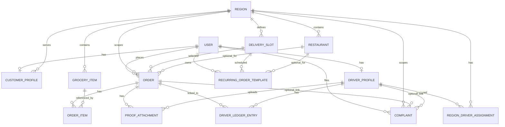

# DeliverU ER Model (Current)

This document is the current ER reference for implementation.

The legacy ER image in `docs/imgs/er-diagram.png` reflects an older academic model. The schema implemented in Slice 0 is based on frozen decisions in `docs/implement.md` and SRS use cases.

## Divergence Note vs Legacy ER Image

- Legacy image models separate `Admin`, `Customer`, and `Driver` entities; implementation uses one `user` table with a role field and profile extensions.
- Legacy image implies simpler assignment and finance; implementation uses `region_driver_assignment` (many-to-many) and unified `driver_ledger_entry`.
- Legacy image does not include recurring and file-proof structures; implementation includes `recurring_order_template` and `proof_attachment`.
- Legacy image treats groceries/restaurants in a simpler static way; implementation keeps both region-scoped and order-linked for operational filtering.
- Legacy image is still useful for concept direction, but the source of truth for implementation is `backend/database/models.py` + Alembic migrations.

## Source of Truth

- Schema: `backend/database/models.py`
- Migrations:
  - `backend/alembic/versions/20260419_0001_user_role_migration.py`
  - `backend/alembic/versions/a7478eab95b0_add_core_deliveru_domain_schema.py`
- Planning decisions: `docs/implement.md`
